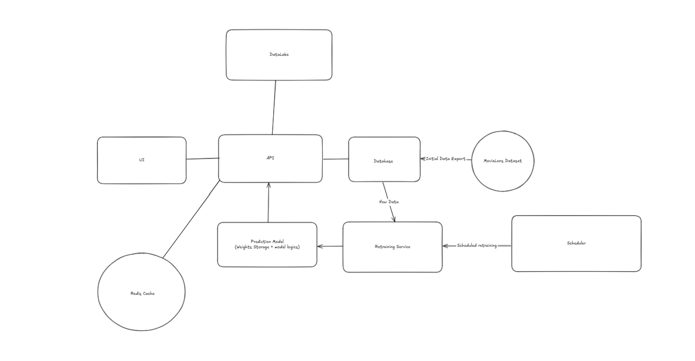

Microservice-Based Movie Recommendation System
## Introduction

This project is being developed for educational purposes to gain experience(and prove an existing one) in designing systems with near-enterprise-level logic and to acquire essential skills with key technologies, including:
- Caching (Redis)
- Cloud Services (Azure)
- Messaging (Apache Kafka)
- Model Management (MLFlow)
- Monitoring (OpenTelemetry, Prometheus, Grafana)
- Orchestration (Apache Airflow)

## Architecture

Below is a high-level overview of the architecture that is likely to be implemented:

The website is built as a static web app that interacts with APIs, due to Azure’s free tier limitations (Static Web Apps + Azure Functions).
 
A Data Lake (Azure Blob Storage) and a Database (Azure SQL Database) will be used to store and manage data.
 
For movie recommendations, a Matrix Factorization model will be used, with its parameters stored in Azure Data Box.
 
A scheduler will trigger model retraining every 24 hours.
 
Redis will be used to cache popular requests to improve performance.